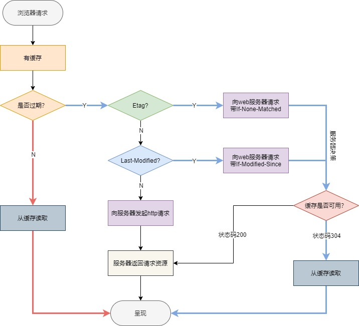
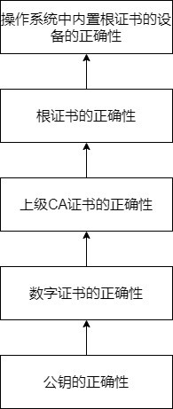
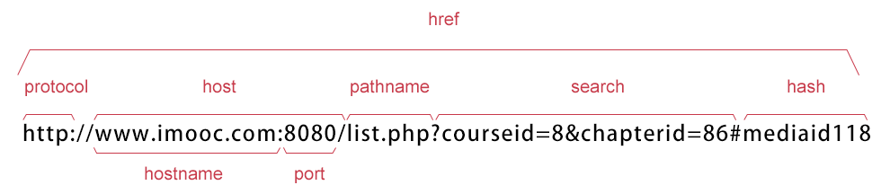

### 一.HTTP

#### **一、HTTP常见状态码**

按第一个数字分类：1表示信息，2表示成功，3表示重定向，4表示客户端错误，5表示服务器错误

| 状态码                    | 含义                                                         |
| ------------------------- | ------------------------------------------------------------ |
| 200 OK                    | 请求成功。一般用于get和post请求                              |
| 301 Moved Permanently     | 永久移动。请求的信息已经被移动到新的URI，会返回新的URI       |
| 302 Found                 | 临时移动。资源只是临时被移动，客户端继续使用原URI            |
| 304 Not Modified          | 未修改。所请求的资源未修改，服务器返回此状态码，不会返回任何资源 |
| 400 Bad Request           | 客户端请求的语法错误，服务器无法理解（产生原因：前端提交的数据在后台找不到与之相对应的实体） |
| 401 Unauthorized          | 当前请求需要用户验证                                         |
| 403 Forbidden             | 服务器已经收到请求，但拒绝执行                               |
| 404 Not Found             | 服务器无法根据用户的请求找到资源                             |
| 500 Internal Server Error | 服务器内部错误，无法完成请求                                 |

#### **二、HTTP的首部有哪些？**

- 通用首部：表示一些通用信息，如date表示报文创建时间
- 请求首部：请求报文独有，如cookie、If-Modified-Since
- 响应首部：响应报文独有，如set-cookie、Last-Modified
- 实体首部：描述实体部分，如allow用来描述可执行的请求方法、content-type描述主体类型、content-Encoding描述主体的编码方式

#### **三、HTTP支持的方法**

| 方法    | 作用                                                         |
| ------- | ------------------------------------------------------------ |
| get     | 请求指定的页面信息并返回响应主体，一般用于数据的读取         |
| post    | 向指定资源提交数据，请求服务器去处理                         |
| head    | 获取服务器的响应头信息，常用于客户端查看服务器的性能         |
| options | 请求服务器返回该资源所支持的所有HTTP请求方法，常用于客户端查看服务器的性能 |
| put     | 向指定资源位置上传其最新内容                                 |
| delete  | 请求服务器删除所请求URI所标识的资源                          |
| connect | 将连接改为管道方式的代理服务器，常用于SSL加密服务器与非加密的HTTP代理服务器的通信 |
| trace   | 请求服务器回显其收到的请求信息，常用于HTTP请求的测试或诊断   |

#### **四、get和post有什么区别？**

get和post本质上就是TCP链接，并无差别，但由于HTTP的规定和浏览器、服务器的限制，导致它们在应用过程中有一些不同：

- get参数通过URL传递；post放在request body中
- get请求在URL中传递的参数有长度限制；post没有（HTTP协议未规定，是因为浏览器和服务器的限制）
- get请求只能进行URL编码；post请求有多种编码方式
- get请求参数会被完整保留在浏览历史记录里；post中的参数不会被保留
- get产生一个TCP数据包；post产生两个TCP数据包
- 对于get请求，浏览器将http header和data一并发送，服务器响应200 OK；对于post请求，浏览器先发送header，服务器响应100 Continue，浏览器再发送data，服务器响应200 OK
- 缓存方面：get请求类似于查找的过程，用户获取数据，可以不用每次都与数据库连接，所以可以使用缓存；post请求一般做的是修改和删除工作，必须与数据库交互，所以不能使用缓存

#### **五、http2.0的新特点**

- 基于HTTPS天然具有安全性
- 二进制分帧层：将所有传输信息分割成更小的信息或帧，并进行二进制编码（http2.0性能增强核心）
- 允许多路复用：基于二进制分帧层，在共享TCP连接的基础上，同时发送请求和响应。HTTP消息被分解为独立的帧，而不破坏消息本身的语义，交错发送出去，最后在另一端根据流ID和首部将他们重新组合起来
- 服务器推送：服务端根据客户端的请求，提前返回多个响应，推送额外的资源给客户端，支持缓存（遵循同源策略；基于客户端的请求响应来确定的）

#### **六、HTTP缓存机制**

1. 两种缓存方式，根据响应的header内容来决定

2. 强缓存（状态码：200）：浏览器不向服务器发送任何请求，直接从本地缓存中读取文件并返回（相关字段：Cache-Control、Expires）

3. 协商缓存（状态码304）：浏览器发送请求到服务器，通过服务器来告知缓存是否可用（相关字段：Last-Modified/If-Modified-Since、Etag/If-None-Match）

4. 缓存相关header
   Cache-Control、Expires、Last-Modified/If-Modified-Since、Etag/If-None-Match

5. 流程

   

    

参考：[面试精选之http缓存](https://juejin.im/post/5b3c87386fb9a04f9a5cb037) 

### 二.HTTPS

#### **一、HTTPS工作原理** 

1. 客户端通过URL发起HTTPS请求，要求服务器建立SSL链接
2. 服务器收到客户端的请求后，返回公钥证书
3. 客户端验证公钥证书是否有效，验证不通过则显示警告信息；验证通过则利用伪随机数生成器生成会话密钥，然后用证书的公钥加密会话密钥并发送给服务器
4. 服务器通过自己的私钥解密会话密钥。至此，客户端和服务器双方都持有了相同的会话密钥
5. 服务器和客户端之间通过会话密钥加密双方间的通信

#### **二、HTTPS加密方式**

HTTPS使用非对称加密传输一个对称密钥，服务器和客户端使用这个对称密钥来加密解密收发数据；而具体传输数据则是用对称加密的方式。

- 对称加密DES：加密和解密使用同一个密钥（速度快）
- 非对称加密RSA：发送端使用公开的公钥加密，接收端使用私密的私钥解密（安全）

#### **三、HTTPS优点和缺点**

**优点**

- 能够进行信息加密、完整性校验和身份验证，很大程度上避免了HTTP协议容易发生信息窃听、信息篡改、信息劫持的风险。

**缺点**

- 握手阶段比较费时，会使页面加载时间延长，增加耗电
- HTTPS缓存不如HTTP高效，会增加数据开销
- SSL证书需要费用，功能越强大的证书费用越高
- SSL证书需要绑定IP，不能在同一个IP上绑定多个域名，ipv4资源支持不了这种消耗

#### **四、HTTPS和HTTP的区别**

HTTP：超文本传输协议，TCP协议的一种，用于从WWW服务器传输超文本到本地浏览器的一种网络协议

HTTPS：HTTP+SSL，是HTTP的安全版，加入SSL层实现加密传输和身份认证

**区别**

- HTTP传输的数据是未加密的，即明文传输；HTTPS是具有安全性的SSL加密传输协议
- HTTPS需要使用SSL证书；HTTP不用
- 端口号不同，HTTP端口号80；HTTPS端口号443
- HTTPS基于传输层；HTTP基于应用层

#### **五、HTTPS中间人攻击及其防范**

MITM中间人攻击：攻击者相当于一个介入通信的传话员，攻击者知道通信双方的所有通信内容且可以任意增加、删除、修改双方的通信内容，而双方对此并不知情。

通信过程安全性的保证（自下而上）

1. 公钥的正确性：双方通信采用非对称加密的方式，非对称加密中私钥不会传递，而公钥是公开的 。
2. 数字证书的正确性：公钥由对方在通信初始提供，但很容易被中间人替换，因此发送公钥的时候也要提供对应的数字证书，用于验证公钥来自于对方而不是中间人。
3. 上级CA证书的正确性：数字证书由上级CA签发给个人或组织，上级CA用自己的私钥给个人证书签名，保证证书的公钥不被篡改。
4. 根证书的私钥不被泄露或其公钥不被篡改：上级CA证书也是由其上级CA签发的，这条信任链一直延续到根证书，而根证书是自签名的。
5. 设备分发到消费者手中之前不被恶意修改：根证书一般通过操作系统而非网络分发；最初的操作系统应采用原始的当面交流的方式分发。因此，硬件厂商和证书签发机构合作，在设备出厂前在其操作系统中内置签发机构的根证书。

参考：[HTTPS 中间人攻击及其防范](https://segmentfault.com/a/1190000013075736)

### 三.浏览器

#### **一、什么是URL**

URL指的是统一资源定位符，即一个给定的独特资源在Web上的地址

**组成部分：**

- protocol：协议，表明浏览器必须使用何种协议
- domain：域名，表示正在请求哪个服务器
- port：端口
- path：网络服务器上资源的路径
- parameters：提供给网络服务器的额外参数
- anchor：资源本身的另一部分的锚点，锚点表示资源中的一种“书签”，给浏览器显示位于该“加书签”位置的内容的方向

#### **二、什么是BOM？有哪些常用BOM对象及其属性？** 

**BOM是浏览器对象**

- location对象：用于获取或设置窗体的URL，并且可以用于解析URL

  

| 属性     | 描述                                    |
| -------- | --------------------------------------- |
| hash     | 设置或返回从井号(#)开始的URL(锚)        |
| host     | 设置或返回主机名和当前URL的端口号       |
| hostname | 设置或返回当前URL的主机名               |
| href     | 设置或返回完整的URL                     |
| pathname | 设置或返回当前URL的路径部分             |
| port     | 设置或返回当前URL的端口号               |
| protocol | 设置或返回当前URL的协议                 |
| search   | 设置或返回从问号(？)开始的URL(查询部分) |

- history对象：记录用户曾经浏览过的页面（URL），并可以实现浏览器的前进与后退相似导航功能

| 属性   | 描述                          |
| ------ | ----------------------------- |
| length | 返回浏览器历史列表中的URL数量 |

| 方法      | 描述                              |
| --------- | --------------------------------- |
| back()    | 加载history列表中的前一个URL      |
| forward() | 加载history列表中的下一个URL      |
| go()      | 加载history列表中的某个具体的页面 |

- navigator对象：包含有关浏览器的信息，通常用于检测浏览器与操作系统的版本

| 属性        | 描述                                       |
| ----------- | ------------------------------------------ |
| appCodeName | 浏览器代码名的字符串表示                   |
| appName     | 返回浏览器的名称                           |
| appVersion  | 返回浏览器的平台和版本信息                 |
| platform    | 返回运行浏览器的操作系统平台               |
| userAgent   | 返回由客户端发送服务器的user-agent头部的值 |

#### **三、Cookie作用**

- 保存用户登录状态：一段时间内免登录
- 跟踪用户行为：天气预报网站中保存用户上次访问时的地区；有换肤功能的网站保存用户上次访问的界面风格

#### **四、Cookie有哪些字段可以设置？**

- name：cookie的名称
- value：cookie的值（文本数据）
- domain：可以访问此cookie的域名
- path：可以访问此cookie的页面路径
- expires/max-age：cookie过期时间
- size：cookie的大小
- httponly：true则只有在http请求头中会带有此cookie信息，而无法通过js脚本来访问cookie
- secure：是否只能通过HTTPS来传递此条cookie

#### **五、Cookie和Session的共同点和区别？**

**共同点**：都是用来跟踪浏览器用户身份的会话方式

**区别**：

- cookie数据保存在浏览器，session数据保存在服务器
- cookie不是很安全，别人可以分析存放在本地的cookie并进行cookie欺骗，考虑安全性使用session
- session会在一定时间内保存在服务器上，当访问增多是会占用服务器性能，考虑性能使用cookie

#### **六、cookie，localStorage，sessionStorage的共同点和区别**

**共同点**：

都是前端本地存储的方式，均保存在浏览器端且同源

**区别**：

- 数据和服务器之间的交互方式
  cookie可以在客户端和服务器之间来回传递
  localStorage和sessionStorage不会主动把数据发送给服务器，仅在本地保存。
- 生命周期
  cookie在设置的有效期到期前都有效，默认是关闭浏览器后失效sessionStorage仅在当前网页会话下有效，关闭页面或浏览器后失效localStorage除非被手动清除，否则始终有效，永久保存
- 存放数据大小
  cookie存储容量较小，一般只有4KB
  localStorage和sessionStorage可以保存5MB的信息
- 作用域
  cookie和localStorage在所有同源窗口都是共享的
  sessionStorage不在不同的浏览器窗口中共享

#### **七、CSRF和XSS攻击及防御手段**

| 名称               | 方式                                                     | 防御手段                                                     |
| ------------------ | -------------------------------------------------------- | ------------------------------------------------------------ |
| CSRF(跨站请求伪造) | 攻击者在页面中嵌入恶意JS脚本，当用户浏览该页面时进行攻击 | cookie设置httponly和secure；进行特殊字符过滤；对用户的输入进行检查 |
| XSS(跨站脚本攻击)  | 攻击者盗用用户身份，以用户名义发送恶意请求               | 使用验证码；检查HTTPS头部referer字段                         |

#### **八、Cookie如何防范XSS攻击？**

在http头部配上set-cookie，其中

httponly：该属性会禁止JS脚本使用document.cookie来访问cookie

secure：该属性告诉浏览器仅在请求为HTTPS的时候才发送cookie

#### **九、在地址栏里输入一个URL,到这个页面呈现出来，中间会发生什么？**

- **简答**

  DNS解析→TCP连接→发送HTTP请求→服务器处理请求并返回HTTP报文→浏览器解析渲染页面→连接结束

- **详细叙述**

  1. 根据URL域名寻找服务器ip，浏览器首先在缓存中查找，查找的顺序是浏览器缓存→系统缓存→路由器缓存，缓存中查找不到则去系统的hosts文件中查找，没有则查询DNS服务器
  2. 得到ip地址后，浏览器根据ip和相应端口号构建一个http请求并将该http请求封装在一个tcp包中，这个tcp包依次经过传输层、网络层、数据链路层、物理层到达服务器，服务器解析这个请求并作出响应，返回相应的html给浏览器
  3. 浏览器根据返回的html来构建DOM树，构建DOM树的过程中如果遇到图片、音视频等资源会并行下载，如果遇到js脚本或外部js连接，则会停止DOM树的构建去执行和下载相应js脚本，这会造成阻塞；之后根据外部样式、内部样式、内联样式构建CSSOM树，构建完成后和DOM树合并成渲染树，主要目的是排除非视觉节点，比如script、meta标签和排除display为none的节点
  4. 进行布局，确定各个元素的位置和尺寸，然后渲染页面，显示给用户
  5. 上述所有请求中都会涉及http缓存机制

#### **十、浏览器在生成页面时会生成哪两棵树？**

DOM树 CSSOM规则树

当浏览器接收到服务器返回的HTML文档后，会遍历文档节点，生成DOM树；CSSOM规则树由浏览器解析CSS文件生成。

#### **十一、前端优化/Web性能优化**

- 降低请求量：合并资源、减少HTTP请求数、gzip压缩
- 加快请求速度：减少域名数、并行加载、预解析DNS
- 缓存：HTTP缓存机制、离线数据缓存localStorage
- 渲染：使用外部JS和CSS、加载顺序（将CSS样式表放在顶部，JS脚本放在底部）、图片懒加载

#### **十二、什么是重排/回流（reflow）和重绘（repaint）？哪些情况会引起重排重绘？怎样减少重排重绘？**

1. 重排：部分或整个渲染树需要重新分析并且节点尺寸需要重新计算 重绘：由于节点的几何属性发生改变或者样式发生改变，屏幕上的部分内容需要更新
2. 引起重排重绘的原因（重排一定重绘，重绘不一定重排）：任何改变用来构建渲染树的信息都会导致一次重排或重绘
   - 浏览器初始化窗口
   - 添加或删除可见的DOM元素
   - 移动或者给页面中的DOM节点添加动画
   - 添加一个样式表，调整样式属性
   - 用户行为，如调整窗口大小、改变字号、滚动等
3. 减少重排重绘的方法：
   - 批量改变和表现DOM：复制即将更新的节点，在副本上操作，然后将旧的节点和新的节点交换；通过display：none属性隐藏元素，添加足够多的变更后，通过display属性显示（只触发两次重排重绘）
   - 使用cssText（动态改变）、className（静态改变）一次性改变属性
   - 对于多次重排的元素，比如动画，使用绝对定位使其脱离文档流，不影响其他元素

#### **十三、图片的懒加载和预加载**

预加载：提前加载图片，当用户需要时可直接从本地缓存中渲染

懒加载/延迟加载：访问页面时先把图片替换成一张占位图，当图片出现在浏览器可视区域时，才显示真正的图片内容

#### **十四、什么是按需加载？**

用户触发了动作时才加载对应的功能

触发的动作：鼠标点击、键盘输入、鼠标移动、窗口大小更改、拉动滚动条等
加载的文件：HTML、CSS、JS、图片等

