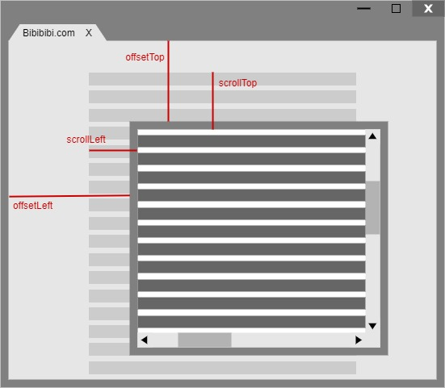

### JavaScript/ES6

#### **一、JS数组常用方法**

| 方法                      | 说明                                                         |
| ------------------------- | ------------------------------------------------------------ |
| push()                    | 添加元素到数组末尾                                           |
| pop()                     | 删除数组末尾元素                                             |
| unshift()                 | 添加元素到数组的头部                                         |
| shift()                   | 删除数组最前面元素                                           |
| indexOf()                 | 查看某个元素在数组中的位置                                   |
| splice(start, num, value) | 实现增删改操作（start开始下标，num删除元素个数，value插入或替换的元素） |
| slice(begin, end)         | 浅拷贝数组并返回拷贝后的新数组                               |
| Array.from()              | 从一个类似数组或可迭代对象中创建一个新的数组实例             |
| fill(value, start, end)   | 用一个固定值填充数组中[start,end)的全部元素                  |
| forEach                   |                                                              |

#### **二、mouseover和mouseenter的区别**

mouseover/mouseout：当鼠标移入元素或其子元素都会触发事件，有一个重复触发的冒泡过程

mouseenter/mouseleave：当鼠标移入元素本身（不包含元素的子元素）会触发事件，即不会冒泡

#### **三、clientHeight, scrollHeight, offsetHeight ,以及scrollTop, offsetTop, clientTop的区别？**

clientHeight：可视区域高度，不包含border和滚动条
offsetHeight： 可视区域高度，包含border和滚动条
scrollHeight：所有区域高度，包含因滚动被隐藏的部分
clientTop：边框border的厚度
scrollTop：滚动后被隐藏的高度，获取对象最顶端与窗口中可见内容最顶端之间的距离
offsetTop：获取指定对象相对于版面或布局中设置position属性的父容器顶端位置的距离

#### **四、JS类型判断**

typeof A、A instanceof B、Object.prototype.toString.call (A)

注意：数组判断不能用typeof（typeof只能判断是否是object）

#### **五、如何获得对象上的属性**

- for(let l in obj)：遍历一个对象及其原型链中所有可枚举的属性
- object.keys：返回一个包含所有可枚举的属性名称的数组
- object.getOwnPropertyNames：返回一个包含不可枚举的属性的数组（基本包装类型的原型属性不可枚举，如Object、Array、Number等）

#### **六、JS语言特点**

- 运行在客户端浏览器上
- 不用预编译，直接解析执行代码
- 弱类型语言，较为灵活
- 与操作系统无关，跨平台
- 脚本语言、解释性语言

#### **七、JS中string的startswith和indexof两种方法的区别**

- str.startsWith(searchString, position)
  searchString：要搜素的子字符串
  position（可选）：搜索searchString的开始位置，默认为0
  能找到返回true，找不到返回false
- str.indexOf(searchValue, fromIndex)
  searchValue：要搜索的字符串
  fromIndex（可选）：开始查找的位置，默认为0
  没找到返回-1，否则返回searchValue第一次出现的索引

#### **八、ES6有哪些新特性？**

- 新增let、const声明变量，实现了块级作用域

- 新增箭头函数

- 引入promise、await/async解决异步回调问题

- 引入Class作为对象的模板，实现更好的面向对象编程

- 引入模块方便模块化编程

- 引入新的数据类型symbol，新的数据结构set和map

  

#### **九、let、const、var区别**

| 类型  | 变量提升 | 暂时性死区 | 重复声明 | 初始值 | 作用域                 |
| ----- | -------- | ---------- | -------- | ------ | ---------------------- |
| var   | 存在     | 不存在     | 允许     | 不需要 | 全局作用域、函数作用域 |
| let   | 不存在   | 存在       | 不允许   | 不需要 | 块级作用域             |
| const | 不存在   | 存在       | 不允许   | 需要   | 块级作用域             |

变量提升：变量可在声明前使用
暂时性死区：代码块内，使用let、const声明变量之前，该变量都是不可用的

#### **十、==和===、以及Object.is的区别**

==：两边值类型不同时，强制转换成number再进行比较（null==undefined→true）

===：严格比较运算符，不会进行强制类型转换（+0===-0 true；NaN===NaN false）

Object.is()：与===基本一致（Object.is(+0,-0) false；Object.is(NaN,NaN) true）

#### **十一、setTimeout、setInterval和requestAnimationFrame**

| 名称                      | 说明                                                         |
| ------------------------- | ------------------------------------------------------------ |
| setTimeout/clearTimeout   | 延时执行参数指定代码                                         |
| setInterval/clearInterval | 每隔一段时间执行指定代码                                     |
| requestAnimationFrame     | 在浏览器每次刷新页面之前执行：1. 会把每一帧中所有的DOM操作集中起来，在一次重绘或回流中就完成，并且重绘或回流的时间间隔紧紧跟随浏览器的刷新频率；2. 对于隐藏元素不会进行重绘或回流，减少了CPU、GPU和内存使用量；3. 由浏览器专门为动画提供的API，在运行时浏览器会自动优化方法的调用；页面如果不是激活状态，动画会暂停播放，有效节省了CPU开销 |

llllllll