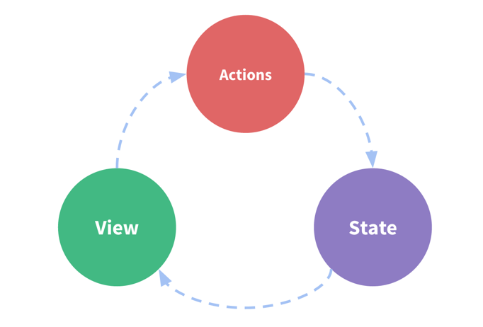

## vuex

#### 官方解释：

​	Vuex 是一个专为 Vue.js 应用程序开发的状态管理模式。它采用 集中式存储管理 应用的所有组件的状态，并以相应的规则保证状态以一种可预测的方式发生变化。不用怀疑，Vuex就是为了提供这样一个在多个组件间共享状态的插件，用它就可以了 

##### 状态管理：

​	几个组件共享的变量全部存储在一个对象里面 。然后，将这个对象放在顶层的Vue实例中，让其他组件	可以使用 。那么，多个组件是不是就可以共享这个对象中的所有变量属性了呢？

### 管理什么状态呢 ？

1.如果你做过大型开放，你一定遇到过**多个状态，在多个界面间的共享问题**。

2.比如用户的**登录状态、用户名称、头像、地理位置信息**等等。

3.比如**商品的收藏、购物车中的物品**等等。

4.这些**状态信息**，我们都可以放在统一的地方，对它进行保存和管理，而且它们还是响应式的

### 单界面的状态管理 




这图片中的三种东西，怎么理解呢？

1.State：不用多说，就是我们的状态。（你姑且可以当做就是data中的属性）

2.View：视图层，可以针对State的变化，显示不同的信息。（这个好理解吧？）

3.Actions：这里的Actions主要是用户的各种操作：点击、输入等等，会导致状态的改变。

### 多界面状态管理 


getters默认是不能传递参数的, 如果希望传递参数, 那么只能让getters本身返回另一个函数. 所以只有在函数内才可以访问变量


mutations不能时异步的


```javascript

```

