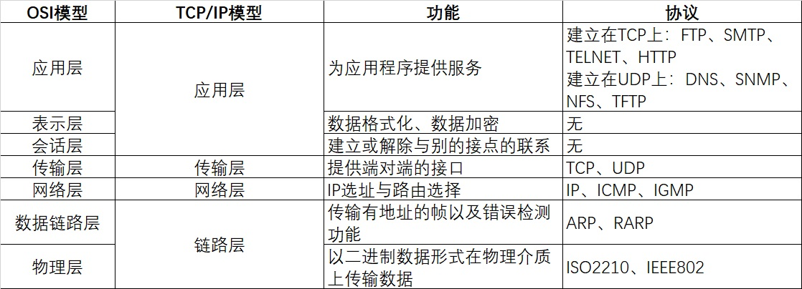

## 1.网络模型与网络协议

### 一.OSI七层模型，TCP/IP概念层模型

### 二、数据的单位**

- 包：全能性术语
- 帧：数据链路层中包的单位
- 数据包：网络层以上的分层中包的单位
- 段：TCP数据流中的信息
- 消息：应用协议中数据的单位

### 三、地址**

- MAC地址：数据链路中的地址，用来识别同一链路中不同的计算机
- IP地址：IP中的地址，用来识别连接到网络中的主机和路由器
- 程序地址（端口号）：识别同一台计算机中进行通信的不同应用程序

## 2.TCP协议与UDP协议

### 一.符号

- SYN：标识位，表示建立链接
- ACK：标识位，表示响应
- FIN：标识位，表示关闭链接
- seq：顺序号码（TCP连接中传送的字节流中的每个字节都按顺序编号）
- ack：确认号码，是期望收到对方下一个报文的第一个数据字节的序号二.TCP的三次握手

### 二.TCP三次握手

1.TCP服务器进程先创建传输控制块TCB，时刻准备接受客户进程的连接请求，此时服务器就进入了	LISTEN（监听）状态；

2.TCP客户进程也是先创建传输控制块TCB，然后向服务器发出连接请求报文，这是报文首部中的同部位SYN=1，同时选择一个初始序列号 seq=x ，此时，TCP客户端进程进入了 SYN-SENT（同步已发送状态）状态。**TCP规定，SYN报文段（SYN=1的报文段）不能携带数据，但需要消耗掉一个序号。**
3.TCP服务器收到请求报文后，如果同意连接，则发出确认报文。确认报文中应该 ACK=1，SYN=1，确认号是ack=x+1，同时也要为自己初始化一个序列号 seq=y，此时，TCP服务器进程进入了SYN-RCVD（同步收到）状态。**这个报文也不能携带数据，但是同样要消耗一个序号。**
4.TCP客户进程收到确认后，还要向服务器给出确认。确认报文的ACK=1，ack=y+1，自己的序列号seq=x+1，此时，TCP连接建立，客户端进入ESTABLISHED（已建立连接）状态。**TCP规定，ACK报文段可以携带数据，但是如果不携带数据则不消耗序号**。
5.当服务器收到客户端的确认后也进入ESTABLISHED状态，此后双方就可以开始通信了。

**Q1:为什么TCP客户端最后还要发送一次确认呢**？
一句话，主要防止已经失效的连接请求报文突然又传送到了服务器，从而产生错误。

如果使用的是两次握手建立连接，假设有这样一种场景，客户端发送了第一个请求连接并且没有丢失，只是因为在网络结点中滞留的时间太长了，由于TCP的客户端迟迟没有收到确认报文，以为服务器没有收到，此时重新向服务器发送这条报文，此后客户端和服务器经过两次握手完成连接，传输数据，然后关闭连接。此时此前滞留的那一次请求连接，网络通畅了到达了服务器，这个报文本该是失效的，但是，两次握手的机制将会让客户端和服务器再次建立连接，这将导致不必要的错误和资源的浪费。

如果采用的是三次握手，就算是那一次失效的报文传送过来了，服务端接受到了那条失效报文并且回复了确认报文，但是客户端不会再次发出确认。由于服务器收不到确认，就知道客户端并没有请求连接。
————————————————

### 三.TCP的四次挥手

1.客户端进程发出连接释放报文，并且停止发送数据。释放数据报文首部，FIN=1，其序列号为seq=u（等于前面已经传送过来的数据的最后一个字节的序号加1），此时，客户端进入FIN-WAIT-1（终止等待1）状态。 **TCP规定，FIN报文段即使不携带数据，也要消耗一个序号。**
2.服务器收到连接释放报文，发出确认报文，ACK=1，ack=u+1，并且带上自己的序列号seq=v，此时，服务端就进入了CLOSE-WAIT（关闭等待）状态。**TCP服务器通知高层的应用进程，客户端向服务器的方向就释放了，这时候处于半关闭状态，即客户端已经没有数据要发送了，但是服务器若发送数据，客户端依然要接受。这个状态还要持续一段时间，也就是整个CLOSE-WAIT状态持续的时间。**
3.客户端收到服务器的确认请求后，此时，客户端就进入FIN-WAIT-2（终止等待2）状态，等待服务器发送连接释放报文（**在这之前还需要接受服务器发送的最后的数据**）。
4.服务器将最后的数据发送完毕后，就向客户端发送连接释放报文，FIN=1，ack=u+1，由于在半关闭状态，服务器很可能又发送了一些数据，假定此时的序列号为seq=w，此时，服务器就进入了LAST-ACK（最后确认）状态，等待客户端的确认。
5.客户端收到服务器的连接释放报文后，必须发出确认，ACK=1，ack=w+1，而自己的序列号是seq=u+1，此时，客户端就进入了TIME-WAIT（时间等待）状态。**注意此时TCP连接还没有释放，必须经过2∗ *∗MSL（最长报文段寿命）的时间后，当客户端撤销相应的TCB后，才进入CLOSED状态。**
6.服务器只要收到了客户端发出的确认，立即进入CLOSED状态。同样，撤销TCB后，就结束了这次的TCP连接。**可以看到，服务器结束TCP连接的时间要比客户端早一些。**

**为什么客户端最后还要等待2MSL？**
MSL（Maximum Segment Lifetime），TCP允许不同的实现可以设置不同的MSL值。

第一，保证客户端发送的最后一个ACK报文能够到达服务器，因为这个ACK报文可能丢失，站在服务器的角度看来，我已经发送了FIN+ACK报文请求断开了，客户端还没有给我回应，应该是我发送的请求断开报文它没有收到，于是服务器又会重新发送一次，而客户端就能在这个2MSL时间段内收到这个重传的报文，接着给出回应报文，并且会重启2MSL计时器。

第二，防止类似与“三次握手”中提到了的“已经失效的连接请求报文段”出现在本连接中。客户端发送完最后一个确认报文后，在这个2MSL时间中，就可以使本连接持续的时间内所产生的所有报文段都从网络中消失。这样新的连接中不会出现旧连接的请求报文。

**Q1：如果已经建立了连接，但客户端突然出现故障怎么办？**

TCP设有一个保活计时器，服务器每收到一次客户端的请求后都会重新复位这个计时器，时间通常设置为2h，若2h之内还没有收到客户端的任何数据，服务器就会发送一个探测报文，之后每隔75s发送一次。若连续发送10个探测报文仍没有回应，服务器就认为客户端出现故障，接着就关闭连接。

**Q2：为什么建立连接是三次握手，关闭连接是四次挥手？**

建立连接的时候，服务器出于监听状态，一旦收到客户端建立连接请求的SYN报文后，可直接将SYN和ACK放在一个报文中返回客户端。

而关闭连接时，服务器收到客户端关闭连接的FIN报文时仅仅表示对方不再发送数据但仍能接受数据，而自己的数据也未必全部发送给对方了，所以此时发送完数据给对方后，再向客户端发送FIN报文来表示同意现在关闭连接，ACK和FIN的分开发送导致挥手比握手多了一次。

### **四、TCP和UDP的区别** 

| TCP                                        | UDP                                                          |
| ------------------------------------------ | ------------------------------------------------------------ |
| 面向连接的可靠性传输                       | 无连接不可靠                                                 |
| 保证数据的无差错、不丢失、不重传且按序到达 | 尽最大努力交付，但不保证可靠交付                             |
| 面向字节流                                 | 面向报文                                                     |
| 只能是一对一                               | 一对一或一对多                                               |
| 首部较大有20字节                           | 首部只有8字节                                                |
| 用于需要可靠传输的情况                     | 用于高速传输和对实时性有较高要求的通信（视频、音频等多媒体通信）或广播通信 |

TCP特点：流量控制、拥塞控制、面向连接、可靠传输 

### **五、TCP滑动窗口和拥塞窗口比较**

1. 滑动窗口：发送方+接收方

   解决发送方和接收方收发数据速率不一致的问题。滑动窗口相当于接收方的缓存，接收方向发送方通知自己可接受数据的大小，而发送方会根据这个数值发送数据

2. 拥塞窗口：发送方

   控制全局网络的拥塞情况。通过控制发送方每次发送的流量多少，来逐渐试探整体网络的拥塞程度。

   如果没有拥塞控制，发送方每次发送的数据大小为滑动窗口，在只有两台主机的时候没有问题，但在现实的网络大环境中，如果每台主机都发送滑动窗口大小的数据，那整个网络系统必然会瘫痪，所以通过在发送方设置拥塞窗口，可以有效缓解网络压力。

### **六、TCP拥塞控制**

慢启动+拥塞避免；快速重传+快速恢复

- 慢启动：防止一开始速率过快，导致耗尽中间路由器存储空间，从而严重降低TCP连接的吞吐量
- 拥塞避免：当拥塞发生时，降低网络传输速率
- 快速重传：在接收到相同ACK后，推断出丢失报文段起始序号，然后立即重传此报文
- 快速恢复：在快速重传基础上，如果发生了快速重传，则执行拥塞避免算法而非慢启动

